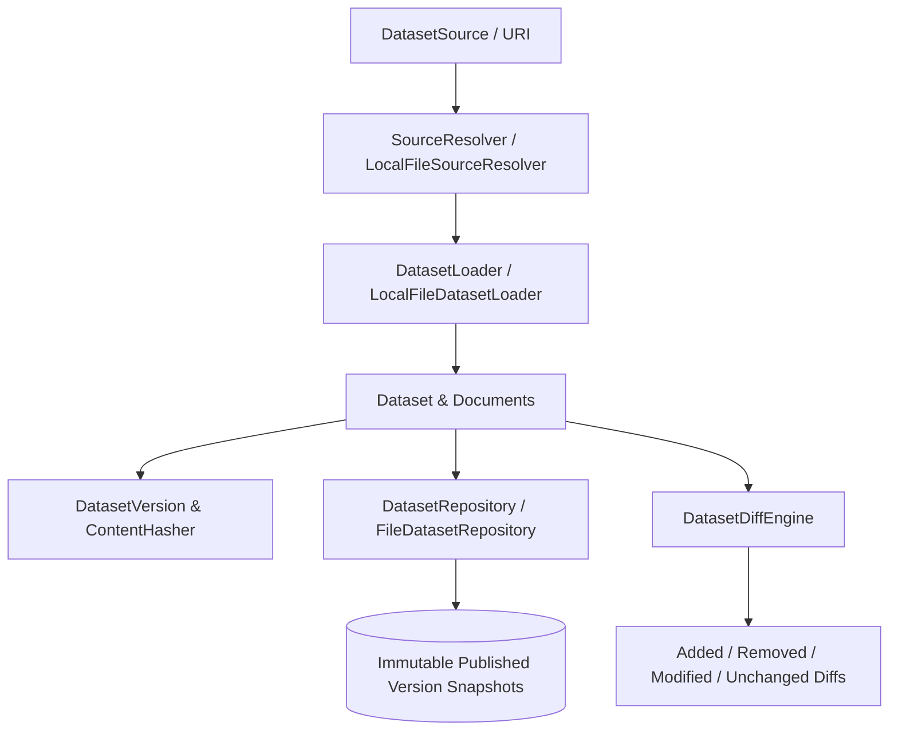

# Dataset Storage, Persistence, and Version Control Specification

- **Purpose:** Define the architectural model, contracts, immutability rules, source resolution drivers, and version control infrastructure for Recon-OS Datasets.
- **Audience:** Core engine maintainers, dataset providers, and pipeline developers integrating storage adapters and version control features.
- **When to update:** When versioning semantics, repository contracts, or source resolution interfaces evolve.

---

## 1. Overview & Architecture

In production RAG systems and evaluation pipelines, document collections constantly evolve. Without immutable dataset versioning, comparing benchmark results across pipeline runs over time becomes impossible because document contents and representations shift.

Recon-OS provides dedicated storage and versioning infrastructure to snapshot dataset states, compute cryptographic content-addressable digests, resolve local/remote data locations, and perform differential diffing between version points.



---

## 2. Dataset Versioning & Immutability Mechanics

### 2.1 Versioning Semantics (`Version`)

Recon-OS enforces Semantic Versioning (SemVer 2.0) format (`MAJOR.MINOR.PATCH`, e.g., `1.0.0`, `1.4.2`, or `v1.4.2`).

```typescript
import { Version } from "@recon-os/core";

const v1 = Version.from("1.4.2");
v1.getMajor(); // 1
v1.getMinor(); // 4
v1.getPatch(); // 2

// SemVer Comparisons
const v2 = Version.from("2.0.0");
v2.isGreaterThan(v1); // true

// Version Incrementation
const vNextMajor = v1.incrementMajor(); // "2.0.0"
const vNextMinor = v1.incrementMinor(); // "1.5.0"
const vNextPatch = v1.incrementPatch(); // "1.4.3"
```

### 2.2 Immutable Version Snapshots (`DatasetVersion`)

Once published, a `DatasetVersion` represents a point-in-time immutable snapshot of a dataset. Any attempt to re-publish or overwrite a published version snapshot throws an `InvalidDatasetError`.

```typescript
import { DatasetVersion, Version, DatasetId } from "@recon-os/core";

const draft = DatasetVersion.create(Version.from("1.0.0"), "Draft release", DatasetId.from("ds_bench"));
draft.isPublished(); // false

// Publish snapshot
const published = draft.publish();
published.isPublished(); // true

// Attempting to re-publish throws InvalidDatasetError:
// "DatasetVersion v1.0.0 is already published and immutable"
```

### 2.3 Cryptographic Content-Addressable Checksums (`ContentHasher`)

Dataset root checksums are calculated deterministically over dataset attributes and document fingerprints sorted by Document ID:

$$\text{RootChecksum} = \text{SHA256}\Big(\text{DatasetMeta} + \sum_{i \in \text{SortedDocs}} \text{Doc}_i\text{Fingerprint}\Big)$$

---

## 3. Source Resolution & Dataset Loading Contracts

### 3.1 `SourceResolver` & `LocalFileSourceResolver`

`SourceResolver` abstracts physical location resolution for local files, directory paths, and URI descriptors into `ResolvedSource`:

```typescript
export interface ResolvedSource {
  readonly uri: URI;
  readonly pathOrLocation: string;
  readonly mediaType?: string;
  readonly scheme?: string;
  readonly exists?: boolean;
  readonly isDirectory?: boolean;
  readonly size?: number;
  readonly metadata?: Record<string, unknown>;
}
```

```typescript
import { LocalFileSourceResolver } from "@recon-os/core";

const resolver = new LocalFileSourceResolver();
const resolved = await resolver.resolve("file:///path/to/dataset.json");
```

### 3.2 `DatasetLoader` & `LocalFileDatasetLoader`

`LocalFileDatasetLoader` uses streaming read streams (`fs.createReadStream` / `readline`) to load datasets from single files, directories of documents, or JSONL manifests safely without memory spikes.

```typescript
import { LocalFileDatasetLoader } from "@recon-os/core";

const loader = new LocalFileDatasetLoader();
const { dataset, documents } = await loader.load("./data/my_dataset.jsonl");
```

---

## 4. Storage Repository Contract (`DatasetRepository`)

`FileDatasetRepository` provides filesystem-backed persistent storage for dataset manifests, document payloads, and immutable version snapshots.

```typescript
import { FileDatasetRepository, Version } from "@recon-os/core";

const repo = new FileDatasetRepository("./storage");

// 1. Save draft
await repo.save(dataset, documents);

// 2. Publish immutable version snapshot v1.0.0
const snapshot = await repo.publishVersion(dataset, documents, Version.from("1.0.0"), "Initial release");

// 3. Find published version
const v1Data = await repo.findByVersion(dataset.getId(), Version.from("1.0.0"));
```

### 4.1 On-Disk Directory Layout

```
storage/
  └── ds_bench_001/
      ├── manifest.json
      ├── versions/
      │   ├── 1.0.0.json (read-only immutable published snapshot)
      │   └── 1.1.0.json
      └── documents/
          ├── doc_001.json
          └── doc_002.json
```

---

## 5. Version Diffing Engine (`DatasetDiffEngine`)

`DatasetDiffEngine` compares document collections across two version points, categorizing changes into added, removed, modified, and unchanged documents:

```typescript
import { DatasetDiffEngine } from "@recon-os/core";

const diff = DatasetDiffEngine.diff(v1Docs, v2Docs, versionA, versionB);

console.log(diff.summary);
// { totalAdded: 2, totalRemoved: 1, totalModified: 3, totalUnchanged: 10 }

for (const mod of diff.modifiedDocuments) {
  console.log(`Doc ${mod.before.getId().getValue()} changed:`, mod.changes);
  // mod.changes: ['content', 'name', 'metadata']
}
```

---

## 6. Engineering Constraints

1. **Strict Immutability:** Published version snapshots cannot be modified or overwritten once published.
2. **Streaming Safety:** Document read/write operations use Node.js streams to handle large file sizes safely without memory leaks.
3. **Deterministic Hashing:** Cryptographic digests maintain identity sorting so re-ordered inputs yield identical root checksums.
4. **Strict TypeScript Types:** Zero `any` types across interface definitions and value object abstractions.
